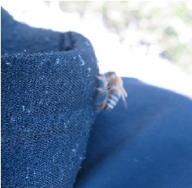

# Welcome to Jennifer's User Page
## Table of Contents
 [Information](#-information)

 [Programming Knowledge](#-programming-knowledge)

 [Goals](#-goals)

 [Fun Stuff](#-fun-stuff)

###  Information
Hello, I am Jennifer. I am currently an undergraduate student majoring in Math-CS in UC San Diego. I am mainly interested in cryptography and network systems. I have a general idea about some cryptosystems and how they function. 

Relevant courses I have taken in UCSD are:
- CSE 11
- CSE 12
- CSE 15L
- CSE 30
- CSE 100
- CSE 105
- MATH 184
- MATH 187A/B

If you want to see my programming knowledge, head over [here](#-programming-knowledge).

###  Programming Knowledge 
I have programmed in various languages, with some being used more than others.
The languages, listed from my most experienced to least:
1. C/C++
2. Java
3. Python
4. ~~MatLab~~
   
As I am the most knowledgable about C, I shall provide my ***favorite code***:
```
printf("Hello, World!");
```

On a serious note, I have programmed some cryptosystems in Python with Sage additions. They range from simple cryptosystems like Ceasar Cipher to more modern ciphers such as [NTRU conversion](https://en.wikipedia.org/wiki/NTRU).

###  Goals
- [ ] Graduate UCSD
- [ ] Learn about Network Systems
- [x] Learn about Cryptography Systems
- [ ] Make a video game with a friend

###  Fun Stuff
I enjoy playing video games in my free time.
Here's a list of my **favorite** games:
- 100% Orange Juice
- Maplestory
- Yakuza Series
- Bloons TD 6
  


I also read manga and watch anime such as:
- [*Shaman King*](https://en.wikipedia.org/wiki/Shaman_King)
- [*Mieruko-chan*](https://en.wikipedia.org/wiki/Mieruko-chan)

I am always down for suggestions, especially if they are in the horror genre.

Additionally, I also enjoy drawing and image editing.

I had previously worked on a Yearbook team in which I took photos and edited them. My favorite project was reconstructing hands on an individual in a group photo as they made strange gestures in the photo we had taken. 
One may ask:
> Why didn't you retake the photo?

As for the answer to that, we were unable to gather the people in the group photo again due to scheduling issues.

Thank you for reading my page! Have a bee.



As Barry Bee Benson said:
> Ya like jazz?


~~[Link Test](screenshots/screenshot.md)~~

[Link to .gitignore](https://github.com/jlambgit/LabWeek1/blob/vs-read-me/.gitignore)